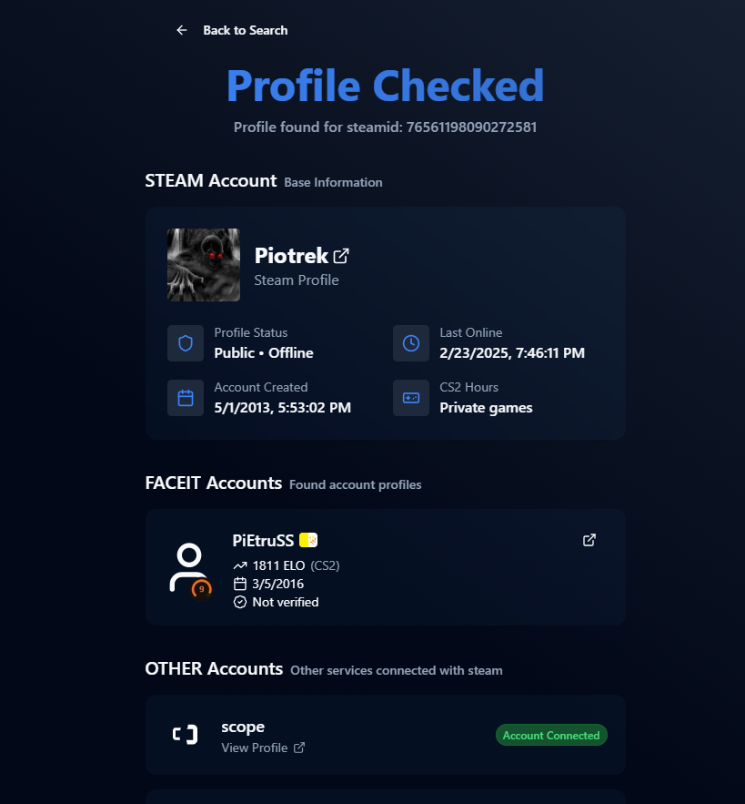
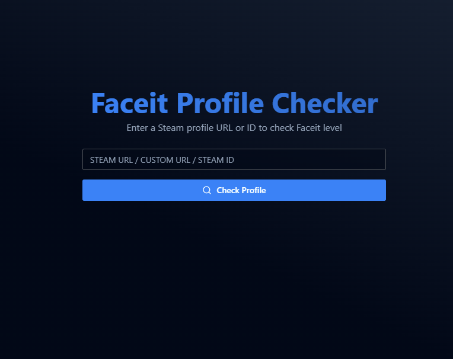

# CS2 player checker

This is a simple application that checks personal data about a player in the game Counter-Strike 2.

Preview: [https://cs2checker.vercel.app/](https://cs2checker.vercel.app/)

## 🛠 Technologies

- Next.js
- React
- TypeScript
- Tailwind CSS
- Shadcn

## ✨ Features

### Fetch player data from:

- Steam profile (games, hours played, lvl, etc)
- Faceit profile (elo, matches, etc)
- Scope.gg profile (if is connected)
- leetify.com
- allstars.gg
- csstats.gg
- steamid.uk
- ~~esportal.com~~ (Fetches blocked)

## 🚀 Preview

### Dashboard:

### Landing input:

## ✨ Future features

- [ ] Login via steam
- [ ] Vote, send reports for cheaters
- [ ] Add stats from fetched sites
- [ ] View last visited, last reported
- [ ] Add more sites to fetch data
